# CassandraDatacenter Reconcile Workflow

This document explains the full `CassandraDatacenterReconciler.Reconcile` workflow from the controller entrypoint down
into the staged reconciliation pipeline in `pkg/reconciliation`.

## How stages work and finish

- Most stages do one safe mutation, then stop.
- A stage can return one of four outcomes:
    - `Continue`: move to the next stage in the same reconcile pass.
    - `Done`: stop now, wait for a new watch event or the next scheduled pass.
    - `RequeueSoon(n)`: stop now and explicitly retry after `n` seconds.
    - `Error`: stop now and return an error to controller-runtime. Causes the controller to requeue and retry the
      reconciliation
    - `Terminal error`: A permanent failure that should not be retried (like validation errors in step 3).
- Because of that, a single reconcile pass usually does not run the whole chain end to end.

## Workflow chart

## Stage Descriptions

### 1. `Reconcile`

Location: `internal/controllers/cassandra/cassandradatacenter_controller.go`

What it does:

- Creates a logger enriched with datacenter name, namespace, request name, and a per-loop `loopID`.
- Builds a `ReconciliationContext`.
- Validates the CR.
- Enforces a startup cooldown after `Status.LastServerNodeStarted`.
- Delegates the actual work to `CalculateReconciliationActions`.

Why the cooldown and quiet period matter:

- Starting Cassandra is not an instant state transition.
- Kubernetes state, sidecars, and Cassandra ring state lag behind spec changes.
- Without the delay, the operator could pile new mutations on top of an unstable cluster.

### 2. `CreateReconciliationContext`

Location: `pkg/reconciliation/context.go`

What it does:

- Stores the request, client, scheme, recorder, image registry, dynamic secret watches, and cluster-scope mode.
- Fetches the `CassandraDatacenter`.
- Normalizes zero-value timestamps in status such as `SuperUserUpserted`, `LastServerNodeStarted`, and
  `LastRollingRestart`.
- Builds `NodeMgmtClient`, which is used later for:
    - lifecycle start
    - drain
    - decommission
    - feature discovery
    - metadata endpoints
    - user creation
    - full query logging

Why it is needed:

- Nearly every later step needs both Kubernetes state and Cassandra management API state.
- Putting that setup in one place keeps the staged reconciler deterministic.

### 3. `IsValid`

Location: `pkg/reconciliation/handler.go`

What it checks:

- datacenter name override immutability
- superuser secret rules
- additional user secret rules
- FQL (Full Query Logging) config validity
- service labels and annotations validity
- management API config validity
- sanitized datacenter-name conflicts in the same namespace
- required storage claim fields

Why it is needed:

- It rejects invalid desired state before the operator mutates cluster resources.
- Returning a terminal error here is safer than letting invalid state propagate into `StatefulSet`, secret, or mgmt API
  updates.

### 4. `ProcessDeletion`

Location: `pkg/reconciliation/reconcile_datacenter.go`

What it does:

- Exits immediately if deletion is not in progress.
- Skips all finalizer work if the finalizer is already gone.
- Sets operator progress to `Updating`.
- If decommission-on-delete is enabled and the cluster still has more than one datacenter:
    - marks the datacenter for decommission
    - waits for normal scale-down/decommission logic to drain to zero
- Otherwise:
    - computes rack information
    - scales every rack `StatefulSet` to zero without Cassandra decommission
    - waits until all rack replica counts reach zero
- Removes dynamic secret watchers for this datacenter.
- Deletes PVCs, unless PVC deletion is explicitly disabled.
- Clears finalizers and updates the CR so Kubernetes can finish deletion.

Why it is needed:

- Deletion is not just removing the CR.
- Cassandra nodes may need graceful decommissioning, PVC cleanup, and watch cleanup.

### 5. `addFinalizer`

Location: `pkg/reconciliation/handler.go`

What it does:

- Adds the operator finalizer unless `NoFinalizerAnnotation` is present or deletion already started.
- Updates the CR immediately.

Why it is needed:

- Without a finalizer, Kubernetes could delete the CR before the operator cleans up dependent state.

### 6. `CheckHeadlessServices`

Location: `pkg/reconciliation/reconcile_services.go`

What it does:

- Builds the desired service set:
    - CQL service
    - seed service
    - all-pods service
    - additional-seed service
    - optional NodePort service
- Sets owner references.
- Creates missing services.
- Updates existing services when the desired hash differs.
- Preserves immutable or runtime-managed fields like `ClusterIP`.
- If `AdditionalSeeds` are configured, continues into `CheckAdditionalSeedEndpointSlices`.

Why it is needed:

- Cassandra discovery and traffic routing depend on a specific service topology.
- Those services must exist before the operator can safely manage pods and seeds.

### 7. `CheckAdditionalSeedEndpointSlices`

Location: `pkg/reconciliation/reconcile_endpoints.go`

What it does:

- Builds the desired `EndpointSlice` objects for additional seeds.
- Creates, updates, or deletes them as needed.
- Removes legacy `Endpoints` objects left over from earlier behavior.

Why it is needed:

- External or additional seeds are not represented by operator-owned Cassandra pods.
- The operator still needs to expose them to the cluster in a Kubernetes-native way.

### 8. `CalculateRackInformation`

Location: `pkg/reconciliation/reconcile_racks.go`

What it does:

- Computes desired node count and seed count per rack.
- Forces total node count to zero if `spec.stopped` is true.
- Splits both total replicas and total seeds across the declared racks.
- Stores desired rack info and placeholder statefulset slots in the context.

Why it is needed:

- The operator needs a deterministic target distribution of nodes and seeds across racks.
- Later steps compare actual rack state against this computed target.

### 9. `ReconcileAllRacks`

Location: `pkg/reconciliation/reconcile_racks.go`

What it does:

- First, it gathers the current state:
- Lists all cluster pods
- Derives the datacenter's pod set from cluster labels
- Fetches Cassandra metadata endpoints from the management API
- Then, it delegates to a series of ordered stages that safely converge the datacenter to its desired state

Why that is needed:

- This is the main orchestrator that brings the datacenter to its desired state.

### 10. `CheckStatefulSetControllerCaughtUp`

Location: `pkg/reconciliation/reconcile_racks.go`

What it does:

- Verifies each rack `StatefulSet` has matching `generation` and `observedGeneration`.
- Verifies pods that should exist actually exist.
- Detects a known PVC/pod race and deletes pods stuck pending because their PVC vanished.

Why it is needed:

- Without this gate, later steps would fail on missing pods/PVCs or act on stale `StatefulSet` status.

### 11. `UpdateStatus`

Location: `pkg/reconciliation/reconcile_racks.go`

What it does:

- Recomputes `NodeStatuses` by querying live pod and mgmt API state.
- Updates replace-node progress and initiates requested replacements.
- Patches object-level fields if they changed.
- Patches status separately if status changed.
- Updates monitoring metrics for pod state.

Why it is needed:

- Later steps use status to decide whether nodes are bootstrapped, replacing, healthy, or missing host IDs.

### 12. `CheckConfigSecret`

Location: `pkg/reconciliation/reconcile_configsecret.go`

What it does:

- Loads the user-specified `ConfigSecret`.
- Ensures the secret carries the datacenter annotation.
- Converts the config to the final JSON form expected by Cassandra.
- Applies CDC-related config augmentation.
- Creates or updates the operator-owned datacenter config secret.
- Updates the datacenter config-hash annotation.

Why it is needed:

- Users can give their own Cassandra settings that the operator mixes with its defaults.
- The operator must not mutate the user-owned source secret directly.

### 13. `CheckRackCreation`

Location: `pkg/reconciliation/reconcile_racks.go`

What it does:

- For each desired rack, looks up the rack `StatefulSet`.
- If missing, builds a new one and creates it through `ReconcileNextRack`.
- Stores the resulting `StatefulSet` pointers in the context.

Why it is needed:

- The entire rack pipeline assumes every desired rack has a concrete `StatefulSet` object.

### 14. `ReconcileNextRack`

Location: `pkg/reconciliation/reconcile_racks.go`

What it does:

- Sets operator progress to `Updating`.
- Creates the new `StatefulSet`.
- Emits an event.
- Runs `ReconcilePods` so existing pods and PVCs left from edge cases or recreated `StatefulSet`s get relabeled
  correctly.

Why it is needed:

When creating a rack, all its resources must have correct labels.

### 15. `CheckRackLabels`

Location: `pkg/reconciliation/reconcile_racks.go`

What it does:

- Computes desired rack-level labels.
- Merges operator metadata.
- Patches the `StatefulSet` if labels or annotations drifted.

Why it is needed:

- Rack StatefulSets have labels and annotations that other parts of the system depend on for pod selection, seed
  services, PVC cleanup, and monitoring.

### 16. `CheckDecommissioningNodes`

Location: `pkg/reconciliation/decommission_node.go`

What it does:

- If `ScalingDown` is not active, it does nothing.
- For pods marked `Decommissioning`, checks ring metadata to see whether decommission started or completed.
- Retries the decommission call if it never really started.
- When a node finishes leaving the ring:
    - shrinks the owning `StatefulSet`
    - deletes that pod’s PVCs
    - removes the node from status
- Clears `ScalingDown` when no decommissioning pods remain.

Why it is needed:

- Shrinking replicas before ring exit risks data loss and incorrect token ownership.

### 17. `CheckSuperuserSecretCreation`

Location: `pkg/reconciliation/reconcile_racks.go`

What it does:

- Retrieves the superuser secret or creates the default one.

Why it is needed:

- Cassandra management and user creation need a superuser credential. Later steps assume this credential exists.

### 18. `CheckInternodeCredentialCreation`

Location: `pkg/reconciliation/reconcile_racks.go`

What it does:

- Returns immediately if legacy internode auth is not enabled.
- Otherwise retrieves or creates the required secret.

Why it is needed:

- Legacy internode auth setups need credential material before pods start. Pod templates and startup config depend on
  this secret.

### 19. `CheckRackStoppedState`

Location: `pkg/reconciliation/reconcile_racks.go`

What it does:

- For every rack with replicas, sets conditions indicating the datacenter is stopping.
- Drains running nodes through the management API.
- Scales rack replicas to zero.
- Stops after those mutations so Kubernetes can converge.

Why it is needed:

- The `spec.stopped` setting gracefully halts the datacenter without deleting data. The cluster is shut down cleanly
  while keeping all persistent storage intact.

### 20. `CheckRackForceUpgrade`

Location: `pkg/reconciliation/reconcile_racks.go`

What it does:

- Detects failure modes such as failed scheduling or crash loops.
- Forces a targeted pod-template reconciliation for the failed rack.
- Also honors `spec.forceUpgradeRacks`.

Why it is needed:

- Sometimes the operator must force updates even when the cluster is unhealthy. A broken rack may never fix itself
  unless the operator pushes an updated template.

### 21. `CheckRackScale`

Location: `pkg/reconciliation/reconcile_racks.go`

What it does:

- Compares desired per-rack size with current `StatefulSet` replica count.
- Sets `Stopped`, `Resuming`, or `ScalingUp` conditions appropriately.
- Increases replicas when needed.

Why it is needed:

- Scale-up is handled separately from scale-down because the safety rules are different. The operator can safely create
  more pods, but scale-down requires Cassandra-aware decommission (handled elsewhere).

### 22. `CheckPodsReady`

Location: `pkg/reconciliation/reconcile_racks.go`

What it does:

- Reclassifies nodes that lost readiness or regained it.
- Deletes stuck pods.
- Recomputes seed labels and refreshes seed lists on started nodes.
- Optionally fast-starts already bootstrapped nodes.
- Waits while any node is currently in `Starting`.
- Starts one node per rack first.
- Verifies cluster health with a `LOCAL_QUORUM` probe before broadening startup.
- Starts the remaining nodes in a balanced cross-rack sequence.
- Waits for replacements to finish.
- Performs a final ready-versus-started sanity check.

Why it is needed:

- This is the Cassandra startup orchestration.
- Kubernetes creating a pod is not enough - Cassandra inside must start in the right order.
- Startup order matters for seed discovery, bootstrapping, and ring health.
- The operator is careful to avoid starting too many nodes at once.

#### 22a. `labelSeedPods`

Location: `pkg/reconciliation/reconcile_racks.go`

What it does:

- Sorts rack pods deterministically.
- Labels the right number of ready pods as seeds.
- Removes stale seed labels from pods that should no longer be seeds.

Why it is needed:

- Seed labels drive the seed service and therefore cluster discovery.

#### 22b. `refreshSeeds`

Location: `pkg/reconciliation/reconcile_racks.go`

What it does:

- Calls the mgmt API seed-reload endpoint on pods labeled `Started`.

Why it is needed:

- Running nodes need their seed list refreshed as topology changes.

#### 22c. `findStartingNodes`

Location: `pkg/reconciliation/reconcile_racks.go`

What it does:

- Looks for pods labeled `Starting`.
- If a starting pod is now ready, relabels it `Started`.
- Otherwise forces the loop to wait and requeue.

Why it is needed:

- The operator should not start more nodes while one is already in the middle of startup.

#### 22d. `startOneNodePerRack`

Location: `pkg/reconciliation/reconcile_racks.go`

What it does:

- Walks racks in declared order.
- Attempts to start a ready-to-start pod in each rack.
- Optionally prelabels the first node as a seed when no ready seeds exist and there are no additional seeds.

Why it is needed:

- The first safe startup stage is to get at least one viable node per rack before trying to fill the datacenter.

Important implementation note:

- The current code computes `podName` from `maxPodRankInThisRack` inside the inner loop instead of `podRankWithinRack`.
- In practice that means the highest ordinal is repeatedly inspected within that loop body.

#### 22e. `startAllNodes`

Location: `pkg/reconciliation/reconcile_racks.go`

What it does:

- Builds a deterministic, rack-balanced startup sequence.
- Defers previously failed pods until the end.
- Starts nodes one by one through `startNode`.

Why it is needed:

- Once the cluster is healthy enough, the operator can start the remaining nodes.

#### 22f. `startCassandra`

Location: `pkg/reconciliation/reconcile_racks.go`

What it does:

- Detects replacement workflows and finds the replace IP from ring metadata when needed.
- Calls the mgmt API lifecycle start endpoint, optionally with replace-IP semantics.
- Labels the pod `Starting` immediately.
- If async startup fails later, deletes the pod and records a failed start in status.

Why it is needed:

- Starting Cassandra is an application-level action, not just a Kubernetes pod-state transition.

### 23. `CheckCassandraNodeStatuses`

Location: `pkg/reconciliation/reconcile_racks.go`

What it does:

- Verifies every started pod has a populated HostID in status.
- Requeues until that is true.

Why it is needed:

- A node is not fully integrated until the operator knows its Cassandra HostID. HostID is required for replacement and
  decommission workflows.

### 24. `DecommissionNodes`

Location: `pkg/reconciliation/decommission_node.go`

What it does:

- Compares current total replicas to target size.
- Computes one-step-down desired rack sizes.
- Chooses the highest ordinal pod in an oversized rack.
- Verifies mgmt API availability and data-absorption safety.
- Calls Cassandra decommission.
- Labels the pod `Decommissioning`.
- Requeues to let `CheckDecommissioningNodes` finish the process.

Why it is needed:

- This is the scale-down planner for live clusters. Cassandra scale-down must be gradual and topology-aware.

### 25. `CheckRollingRestart`

Location: `pkg/reconciliation/reconcile_racks.go`

What it does:

- Detects a requested rolling restart.
- Stamps `LastRollingRestart`.
- Finds pods older than that cutoff.
- Drains them via mgmt API.
- Deletes them one at a time to let Kubernetes recreate them.

Why it is needed:

- Rolling restart is a user-triggered operation that must happen one pod at a time. Restarting all pods together would
  be unsafe for quorum and service availability.

### 26. `CheckDcPodDisruptionBudget`

Location: `pkg/reconciliation/reconcile_racks.go`

What it does:

- Builds the desired PDB.
- Recreates it if immutable changes are needed.
- Skips it when explicitly disabled.

Why it is needed:

- The datacenter needs a PDB that matches its current size. This prevents voluntary disruptions from dropping too many
  Cassandra nodes at once.

### 27. `CheckPVCResizing`

Location: `pkg/reconciliation/reconcile_racks.go`

What it does:

- Detects in-progress resize and waits.
- Detects failed resize and sets invalid conditions.
- Rejects shrinking volumes.
- Requires the storage-change annotation for expansion.
- Validates storage-class expansion support when cluster-scoped permissions exist.

Why it is needed:

- Storage changes have special safety rules and may need storage-class support. Volume expansion is slow, stateful, and
  not always supported.

### 28. `CheckRackPodTemplate`

Location: `pkg/reconciliation/reconcile_racks.go`

What it does:

- Waits for a rack update already in progress to settle.
- Builds the desired `StatefulSet`.
- If drift exists but upgrades are blocked, sets `RequiresUpdate`.
- If drift exists and updates are allowed:
    - preserves replica count
    - preserves user/admin-set labels and annotations
    - validates volume-claim template changes
    - copies immutable fields from the live object
    - updates the `StatefulSet`
    - or deletes and recreates it if Kubernetes rejects the update as invalid
    - sets `Updating`
    - enables a longer quiet period

Why it is needed:

- This is the main detector for upgrades and config changes.
- It turns spec changes into actual pod-template updates without losing important fields that can't be changed.

### 29. `CheckRackPodLabels`

Location: `pkg/reconciliation/reconcile_racks.go`

What it does:

- Calls `ReconcilePods` for every rack `StatefulSet`.
- `ReconcilePods`:
    - patches pod labels
    - patches PVC labels
    - patches PVC annotations

Why it is needed:

- Pods and PVCs must have correct rack and operator labels. Wrong labels break selectors, cleanup logic, and monitoring.

### 30. `CreateUsers`

Location: `pkg/reconciliation/reconcile_racks.go`

What it does:

- Skips when user creation is disabled, the cluster is stopped, or deletion is in progress.
- Updates dynamic secret watches.
- Ensures the superuser secret exists.
- Calls the mgmt API to upsert every declared user plus the default superuser.
- Records timestamps in status.

Why it is needed:

- Cassandra roles and credentials are managed by the operator. User credentials must match what's defined in the CR, not
  just what's in Kubernetes secrets.

### 31. `CheckClearActionConditions`

Location: `pkg/reconciliation/reconcile_racks.go`

What it does:

- Clears conditions such as:
    - `ReplacingNodes`
    - `Updating`
    - `RollingRestart`
    - `Resuming`
    - `ScalingDown`
- Leaves `Stopped` aligned with the spec.
- Handles scale-up cleanup tasks before clearing `ScalingUp`.
- Forces `Valid` back to true.

Why it is needed:

- Once the pipeline reaches this point, any in-progress operation should be cleared. The CR status should show the
  current state, not old actions.

### 32. `CheckConditionInitializedAndReady`

Location: `pkg/reconciliation/reconcile_racks.go`

What it does:

- Marks `Initialized=true`.
- Marks `Ready=true` unless the datacenter is stopped.

Why it is needed:

- This provides a final readiness signal once all checks pass. Users and other operators rely on these conditions to
  know when the datacenter is ready.

### 33. `CheckFullQueryLogging`

Location: `pkg/reconciliation/reconcile_fql.go`

What it does:

- Checks whether the deployment supports FQL.
- Derives desired FQL state from the CR.
- Verifies each pod supports the needed mgmt API feature.
- Enables or disables FQL on each pod when current state differs.

Why it is needed:

- FQL is a setting managed through the mgmt API after startup. This feature is important but only safe to change after
  the cluster is stable.

### 34. `setOperatorProgressStatus(Ready)`

Location: `pkg/reconciliation/constructor.go`

What it does:

- Sets `Status.CassandraOperatorProgress` to `Ready`.
- Initializes `Status.DatacenterName` if needed.
- Updates monitoring metrics.

Why it is needed:

- The operator shows a simple progress signal in status and metrics. Higher-level tools and operators need this simple
  indicator.

### 35. `setDatacenterStatus`

Location: `pkg/reconciliation/constructor.go`

What it does:

- Updates `ObservedGeneration`.
- Sets `MetadataVersion` if needed.
- Clears `RequiresUpdate`.
- Removes the one-shot update-allowed annotation after a successful reconcile.

Why it is needed:

- A successful reconcile should finalize status tracking. This records that the current generation has been fully
  processed.

### 36. `enableQuietPeriod(5s)`

Location: `pkg/reconciliation/reconcile_racks.go`

What it does:

- Writes `Status.QuietPeriod` to `now + 5s`.

Why it is needed:

- Even after success, the operator waits a short time before taking new actions. This reduces rapid back-to-back changes
  while Kubernetes and Cassandra finish settling.

